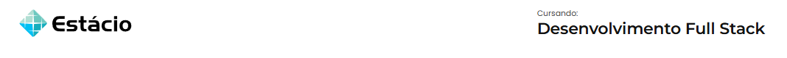

---

- Aluno: **Luiz Fabrício Mello Ferreira**
- Matrícula: **202302891292**
- Curso: **Desenvolvimento Full Stack**
- Turma: **2025.1**

---

# Bem-vindo(a) ao App desenvolvido com React Native e Expo 👋

Este é um projeto [Expo](https://expo.dev) em React Native, criado com [`create-expo-app`](https://www.npmjs.com/package/create-expo-app)

## Pré-requisitos

1. Certifique-se de possuir [Node JS](https://nodejs.org/en) e [Expo](https://expo.dev) instalados.
2. Clone este repositório:

   `git clone https://github.com/cleytonmuto/mundo-4-missao-pratica-1`
3. Acesse o diretório do projeto:

   `cd mundo-4-missao-pratica-1`
4. Instale as dependências do projeto:

   `npm install`
5. Inicie o servidor de desenvolvimento:

   `npm start`
6. Utilize o Expo Client em seu smartphone ou emulador para visualizar o app.

Você também pode encontrar opções para iniciar o app em:

- [development build](https://docs.expo.dev/develop/development-builds/introduction/)
- [Android emulator](https://docs.expo.dev/workflow/android-studio-emulator/)
- [iOS simulator](https://docs.expo.dev/workflow/ios-simulator/)
- [Expo Go](https://expo.dev/go)

## Funcionalidades

- Aplicativo de cadastro de fornecedores
- Listagem de fornecedores
